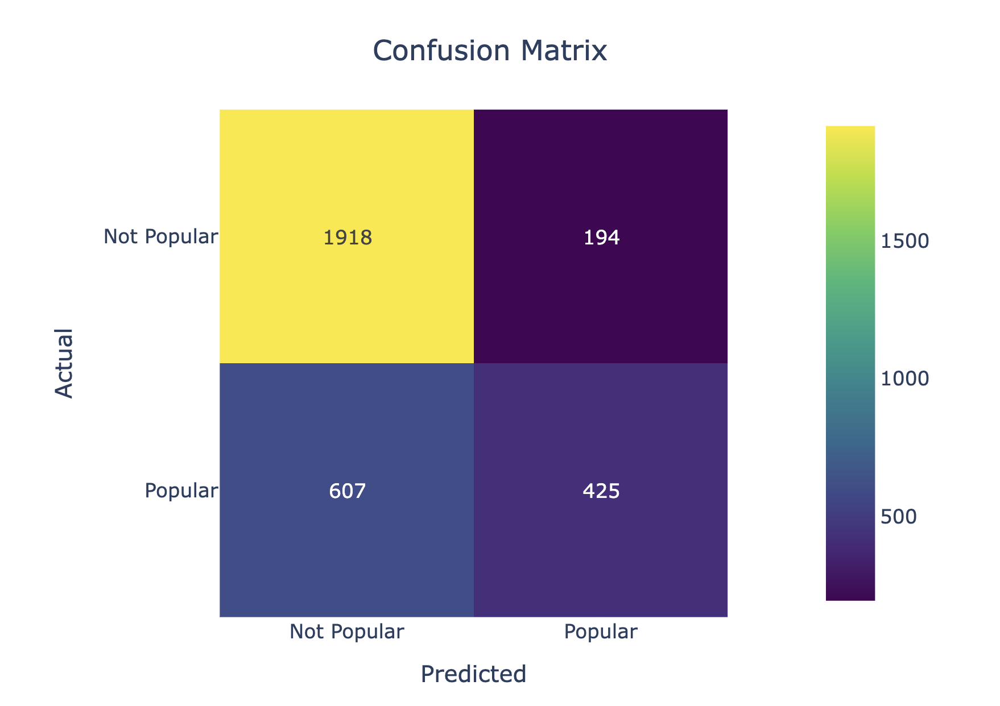

# Good Books - Popularity Prediction Model

A machine learning project to predict book popularity for an online bookstore using sentiment analysis and feature engineering.

## 📊 Dataset Overview

### Original Dataset Columns

| Column | Type | Description | Example |
|--------|------|-------------|---------|
| `title` | String | Book title | "We Band of Angels: The Untold Story of American Nurses..." |
| `price` | Float | Book price in USD | 10.88 |
| `review/helpfulness` | String | Helpful reviews / Total reviews | "2/3" |
| `review/summary` | String | Review summary text | "A Great Book about women in WWII" |
| `review/text` | String | Full review text | "I have always been a fan of fiction books set in WW2..." |
| `description` | String | Book description | "In the fall of 1941, the Philippines was a gardenia-scented paradise..." |
| `authors` | String | Book author(s) | "Elizabeth Norman" |
| `categories` | String | Book category | "History" |
| `popularity` | String | Target variable (Popular/Unpopular) | "Unpopular" |

### Sample Data (3 rows)

| title | price | review/helpfulness | review/summary | review/text | description | authors | categories | popularity |
|-------|-------|-------------------|----------------|-------------|-------------|---------|------------|------------|
| We Band of Angels: The Untold Story of American Nurses Trapped on Bataan by the Japanese | 10.88 | 2/3 | A Great Book about women in WWII | I have always been a fan of fiction books set in WW2, even though I am not sure why... | In the fall of 1941, the Philippines was a gardenia-scented paradise... | Elizabeth Norman | History | Unpopular |
| Prayer That Brings Revival: Interceding for God to move in your family, church, and community | 9.35 | 0/0 | Very helpful book for church prayer groups and if you are by yourself. | Very helpful book to give you a better prayer life. It brings clarity and understanding... | In Prayer That Brings Revival, best-selling author David Yonggi Cho shares key principles... | Yong-gi Cho | Religion | Unpopular |
| The Mystical Journey from Jesus to Christ | 24.95 | 17/19 | Universal Spiritual Awakening Guide With Some Too Radical Approaches | The message of this book is to find yourself as that what you are: The Self, without any separations... | THE MYSTICAL JOURNEY FROM JESUS TO CHRIST Discover the ancient Egyptian origins... | Muata Ashby | Body, Mind & Spirit | Unpopular |

## 🔄 Data Transformation

### Feature Engineering
1. **Review Helpfulness Features:**
   - `total_reviews`: Extracted from `review/helpfulness` (e.g., "2/3" → 3)
   - `helpful_reviews`: Extracted from `review/helpfulness` (e.g., "2/3" → 2)
   - `percentage_helpful`: Calculated ratio (helpful_reviews / total_reviews)

2. **Sentiment Analysis Features:**
   - `review_summary_sentiment_score`: Sentiment score for review summaries
   - `review_text_sentiment_score`: Sentiment score for full review text
   - `description_sentiment_score`: Sentiment score for book descriptions

3. **Target Variable:**
   - `popularity`: Converted from string to binary (Popular=1, Unpopular=0)

### Final Features Used
- `price`
- `total_reviews`
- `helpful_reviews`
- `percentage_helpful`
- `review_summary_sentiment_score`
- `review_text_sentiment_score`

## 🤖 Model

**Algorithm:** Random Forest Classifier
- **n_estimators:** 100
- **random_state:** 42
- **Framework:** Scikit-learn

## 📈 Performance Metrics

| Metric | Score |
|--------|-------|
| **Accuracy** | 74.19% |
| **ROC-AUC** | 81.07% |

### Model Performance Details
- **Target Accuracy:** 70% ✅ (Achieved 74.19%)
- **Confusion Matrix:**  
  

- **Classification Report:** Detailed precision, recall, F1-score

## 🛠️ Technical Stack

- **Python 3.9+**
- **Pandas** - Data manipulation
- **Scikit-learn** - Machine learning
- **Transformers (Hugging Face)** - Sentiment analysis
- **Plotly** - Visualization

## 📁 Project Structure

```
good-books/
├── workspace/
│   ├── data/
│   │   ├── books.csv              # Original dataset
│   │   ├── books_train.csv        # Training data
│   │   └── books_test.csv         # Test data
│   ├── notebook.ipynb             # Main analysis notebook
│   ├── notebook solution.ipynb    # Solution notebook
│   └── requirements.txt           # Dependencies
└── .gitignore                     # Git ignore rules
```

## 🚀 Getting Started

1. **Clone the repository**
2. **Install dependencies:**
   ```bash
   pip install -r workspace/requirements.txt
   ```
3. **Run the notebook:**
   ```bash
   jupyter notebook workspace/notebook.ipynb
   ```

## 📋 TODO List (According to Cursor)

### High Priority
- [ ] **Optimize sentiment analysis pipeline** - Currently creates new pipeline for each batch
- [ ] **Implement batch processing** for sentiment analysis to improve speed
- [ ] **Add cross-validation** for more robust model evaluation
- [ ] **Feature selection** - Test different feature combinations
- [ ] **Hyperparameter tuning** - Optimize Random Forest parameters

### Medium Priority
- [ ] **Try other algorithms** - Gradient Boosting, XGBoost, Neural Networks
- [ ] **Add text preprocessing** - Remove stopwords, stemming, lemmatization
- [ ] **Create feature importance visualization**
- [ ] **Add model interpretability** - SHAP values, LIME
- [ ] **Implement model persistence** - Save/load trained models

### Low Priority
- [ ] **Create API endpoint** for real-time predictions
- [ ] **Add data validation** and error handling
- [ ] **Create automated testing** for model performance
- [ ] **Add logging** for model training and prediction
- [ ] **Create deployment pipeline**

### Data & Analysis
- [ ] **Analyze feature correlations** to identify multicollinearity
- [ ] **Add more text features** - TF-IDF, word embeddings
- [ ] **Investigate class imbalance** in the dataset
- [ ] **Add temporal features** if publication dates available
- [ ] **Create data quality report**

## 🎯 Future Improvements

1. **Advanced NLP Features:**
   - Word embeddings (Word2Vec, GloVe)
   - Topic modeling (LDA)
   - Named entity recognition

2. **Model Ensemble:**
   - Combine multiple algorithms
   - Stacking and blending techniques

3. **Real-time Prediction:**
   - REST API for predictions
   - Batch prediction pipeline

4. **Monitoring & Maintenance:**
   - Model drift detection
   - Performance monitoring
   - Automated retraining

## 📝 Notes

- The model successfully exceeds the 70% accuracy target
- Sentiment analysis significantly improves model performance
- Review helpfulness features provide valuable insights
- The current implementation could be optimized for better performance
